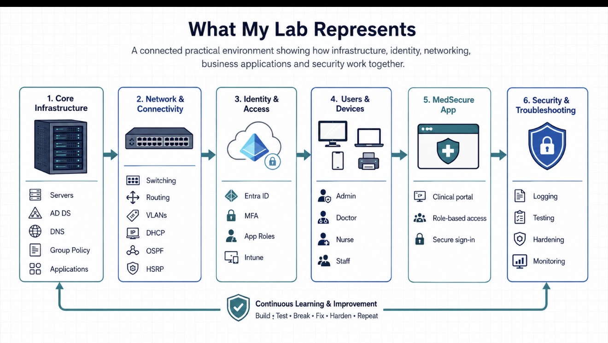

Connected Business IT Environment

I am building practical IT infrastructure labs to understand how the main technology components of a real business work together.

The goal of these projects is to cover the major areas an organisation depends on every day: networking, users and devices, servers, Active Directory, DNS, Group Policy, cloud identity, endpoint management, security, business applications and troubleshooting.

Rather than treating each topic as a separate lab, I am building them as one connected environment so I can understand the full flow of IT inside an organisation.

## How the projects connect

